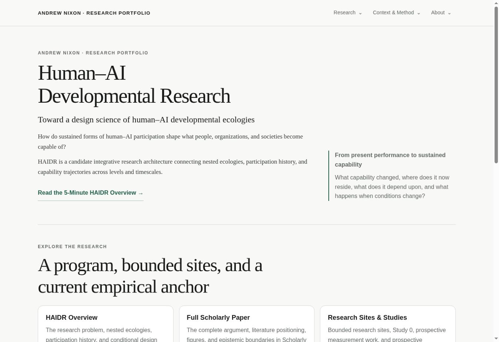

# HAIDR v0.4 portfolio reconciliation — final implementation report

Date: September 26, 2026. **Released to production.** Public portfolio: [andrew-nixon-research-portfolio.vercel.app](https://andrew-nixon-research-portfolio.vercel.app/).

Deployed content commit: `c9e17901188fec5a0e32098efe4b4fb2c9c751ca` on GitHub `main`. Production deployment: `dpl_BCWmcG9YjHuBjDDXD7Noz3kg5biL`, Vercel status **READY**. The same commit passed the final preview at `https://andrew-nixon-research-portfolio-oszq5tkgn-andrew-nixon.vercel.app/` before production publication. The static-site build completed in approximately 5.3 seconds. Subsequent report/evidence changes do not alter the deployed application.

1. **State found.** Repository `philosomystic/aimr-research-portfolio`, production source commit `c96dedad27e71f09e157473cc451b6707e15ca96`. The deployed application is a static site rooted at `aimr-portfolio-v2.0-post-qa/portfolio-web-shell-v0.1-v2.0`. Audited all 21 existing HTML destinations, their live responses, assets, and the 94-card atlas. The older hub lived at `/research/human-ai-pathways/`; AIMR redirected there. Experimental Program and CDAVA remained current destinations.

2. **Page dispositions implemented.** The table below records the actual implementation. Global navigation now uses **Research / Context & Method / About**, with About and CV grouped together and Home accessible through the site identity. Existing visual language is retained: serif headings, neutral background, green accents, restrained cards, and the existing portrait.

| Existing destination | Disposition and current destination |
| --- | --- |
| `/` | REBUILD — current HAIDR introduction and faculty reading path |
| `/research/` | REBUILD — overview, paper, and Research Sites & Studies |
| `/research/5-minute-overview/` | REBUILD — complete frozen DOCX text and its three supplied graphics |
| `/research/human-ai-pathways/` | REDIRECT — `/research/haidr/` |
| `/research/aimr/` | REBUILD — substantive AIMR research-site page; redirect removed |
| `/research/study-0/` | REFRAME — AIMR empirical anchor; preserve 0R, 0R-X, 0P and frozen protocol boundary |
| `/research/cdava/` | DEPRECATE — unlisted, noindex provenance pointer explaining absorption |
| `/research/experimental-program/` | REDIRECT — `/research/sites/` |
| `/research/experimental-program/developmental-dashboard/` | MOVE + REFRAME — `/research/developmental-measurement-inference/` |
| `/research/experimental-program/wunderhorn/` | MOVE + REFRAME — `/research/wunderhorn/` |
| `/research/experimental-program/research-methodology-acquisition/` | MOVE — `/research/prospective/research-methodology-acquisition/` |
| `/research/experimental-program/wayfinder/` | MOVE + REFRAME — `/research/prospective/wayfinder/` |
| `/research/human-ai-development-research-landscape/` | REFRAME — v0.4 ancestry and inferential interfaces; retain atlas |
| `/research/human-ai-development-research-landscape/app/` | REFRAME — qualify hub/bridge language; retain all 94 nodes and existing IDs |
| `/research/human-ai-scholarship-method/` | KEEP + explicit reflexive-method boundary; retain substantive argument |
| `/about/` | REFRAME — current scholarly identity; preserve intellectual trajectory |
| `/cv/` | REFRAME — current program structure and v0.4 paper; preserve education, employment, and historical publications |
| `/teaching/`, `/scholarship/`, `/practice/` | KEEP continuity to existing CV section anchors; add provider redirects |
| `/404.html` | KEEP + current navigation and recovery links |

3. **New destinations.** Eleven canonical destinations were added, including moved/reframed material:

| Public destination | Canonical route | Implementation |
| --- | --- | --- |
| HAIDR Overview | `/research/haidr/` | ADD — current program hub |
| Full Scholarly Paper | `/research/scholarly-paper/` | ADD — accurate v0.4 identification and direct PDF access |
| Research Sites & Studies | `/research/sites/` | ADD — bounded sites, current study, measurement program, and prospective work |
| Organizational Systems | `/research/organizational-systems/` | ADD — concise bounded site |
| Developmental Measurement & Inference | `/research/developmental-measurement-inference/` | MOVE + REFRAME — measurement and inference before a possible dashboard |
| Neuroscience & Passive Sensing | `/research/neuroscience-passive-sensing/` | ADD — concise bounded site |
| Collective Intelligence | `/research/collective-intelligence/` | ADD — concise bounded site |
| Wunderhorn | `/research/wunderhorn/` | MOVE + REFRAME — bounded hypothesis generator |
| AI-Mediated Research Methodology Acquisition | `/research/prospective/research-methodology-acquisition/` | MOVE — prospective sustained-capability study |
| Wayfinder / adaptive interventions | `/research/prospective/wayfinder/` | MOVE + REFRAME — prospective downstream intervention |
| Context & Method | `/context-method/` | ADD — landing page linking Landscape and Scholarship Method |

There are 21 canonical public HTML destinations, plus redirects, provenance, and the error page. The temporary noindex `/__qa__/` responsive inspection harness was removed after inspection and returns 404 in production.

4. **Continuity and archives.** Nine redirect mappings are configured in `vercel.json`, with static forward-pointer fallbacks. All nine mappings reached their intended destinations in the final preview, including the three CV section anchors. Redirect sources include trailing slashes to match the canonical path format. The three non-deployed root atlas files were moved to `docs/archive/legacy-landscape/`. Earlier migration audits remain historical records. CDAVA is unlisted and marked noindex; it explains absorption into the current architecture rather than presenting a current coequal framework.

5. **Content migrations.** Installed the complete frozen short overview; copied the unchanged 34-page v0.4 PDF to `/documents/HAIDR-Scholarly-Positioning-Paper-v0.4.pdf`. AIMR preserves the recognition subcycle, timescales, and 18 participation-protocol dimensions. Study 0 retains the September 18 formal launch boundary, September 3 Pilot 0P-01 exclusion, and Protocol v1.0. Dashboard material now follows measurement science → inference architecture → validation → possible feedback instrument. Prospective studies have explicit statuses. Wunderhorn uses the bounded hypothesis-generation sequence and independent-test requirement.

6. **Figures.** Installed all seven supplied images unchanged: Figures 1–6 and the bounded Wunderhorn graphic. The overview uses Figures 1 and 2 plus Wunderhorn; HAIDR uses Figures 1, 2, and 6; AIMR uses Figures 3 and 4; Sites uses Figure 5. All embedded PDF figures remain intact. Retained the portrait and two method-specific Scholarship Method figures. Older AIMR/HAIP/CDAVA architecture, experimental-configuration, dashboard, Wayfinder, and apprenticeship graphics are no longer displayed on current pages; original assets remain available for historical link continuity.

7. **Stale terminology.** Removed CDAVA dependencies, Experimental Program as umbrella, AIMR-as-program, HAIP-as-program, and the four-project hierarchy from current public content. Reconciled the atlas's earlier reflective/practical central chain and its co-intelligent/corrigibility labels with v0.4. Retained internal atlas compatibility keys so existing shared node/filter URLs continue to work.

8. **Intentional history.** Original AIMR Research Statement, AIMR Précis, AIMR — Living Framework, earlier Coherence paper, and published essay titles remain under clearly historical CV entries. CDAVA occurs only in its provenance pointer. Developmental Dashboard occurs once as the possible later instrument. Old terminology in unserved audits and original legacy asset filenames is provenance, not current program ontology.

9. **Vercel identity.** The project is now named `andrew-nixon-research-portfolio` (confirmed after browser sign-in; the rename was already present). Added the exact requested `andrew-nixon-research-portfolio.vercel.app` domain to Production; Vercel reports Valid Configuration and anonymous HTTP access returns 200. Canonical, OpenGraph, Twitter, CV, sitemap, and robots references use the new domain. The GitHub repository name is unchanged.

10. **Old-domain status.** Configured `aimr-research-portfolio.vercel.app` as a permanent 308 redirect to the new domain. Anonymous HTTP verification confirms that paths and query strings are retained. The new production address serves the reconciled release; the old address continues to resolve through the redirect.

11. **Link, metadata, source, and accessibility QA.** All installed internal links, fragment targets, stylesheet/script/image paths passed the filesystem integrity check. All 121 nonempty frozen overview text blocks matched the DOCX in order; the PDF and seven uploaded figure blobs matched their source hashes. JavaScript syntax and whitespace checks passed. All 21 final-preview pages had the correct new-domain canonical and OpenGraph URL, a description, and one H1. Heading hierarchy has no skipped levels; current images have descriptive alt text. Navigation uses native disclosures, keyboard focus outlines, and Escape handling. Ten external links returned HTTP 200; the historical ULSF article returned HTTP 406 and remains unverified. Final-preview redirects, atlas interactions, keyboard behavior, and removal of the temporary QA route passed.

The anonymous production crawl passed with **zero issues**: 21 canonical pages returned 200 and exactly matched the released HTML; 17 linked assets returned 200; all 18 trailing-slash/slashless variants of the nine legacy routes returned 308 and reached the intended destination; all eight PDF/figure source hashes matched. Production canonicals, OpenGraph URLs, descriptions, H1 counts, alt text, and internal fragment targets passed. Sitemap and robots returned 200; CDAVA retained noindex; the removed QA route returned 404. The old-domain 308 preserved both path and query string.

12. **Visual QA.** Inspected every one of the 21 canonical public destinations at 1180 and 390 CSS-pixel frame widths, including the atlas, using the authenticated Vercel preview. Reviewed long-page typography, figure sizing, cards, table wrapping, the portrait, and CV link wrapping. All observed layouts fit their viewport. Also inspected Home navigation at 320 pixels: menus remain within the viewport and Escape closes them and returns focus. Atlas search returned 10 matching offloading results; a detail card opened correctly on mobile and dismissed with Escape. No site-origin console errors were captured (browser-extension errors were excluded). Fixed duplicate/misplaced landing-page breadcrumbs. These are responsive browser-frame checks, not claims of physical-device testing.

13. **Substantive ambiguities and boundaries.** No unresolved source contradiction prevented implementation. No new program constructs, studies, results, or revised canonical claims were added. The former broad Study 0 internalization falsifier was reconciled with v0.4's explicit distinction between human retention, coupled capability, specialization, displacement, and higher-order reorganization. The existing statement that formal P01 awaits administration is preserved; no later administration was inferred. The scholarly paper and frozen short overview were not substantively edited.

14. **Remaining technical defects and limits.** No site defect remains known after preview QA, the public production crawl, and the live faculty reading path. The historical external ULSF article remains unverified (HTTP 406); its historically accurate citation and URL were preserved. Responsive checks used browser frames rather than physical devices. The temporary QA harness is absent from the release.

15. **Outreach assessment.** **Ready for prospective-faculty outreach.** The live reading path was followed through Home → 5-Minute HAIDR Overview → HAIDR Overview → Research Sites & Studies → AIMR → Study 0. The Full Scholarly Paper and other bounded sites are also directly accessible. Current research, the measurement program, prospective studies, sustained-capability evidence, and Wunderhorn's epistemic boundary are distinguished throughout. The former AIMR umbrella, CDAVA framework, Experimental Program umbrella, and four-project structure no longer compete with the current program architecture.

Evidence: [release record](haidr-v04-release-evidence.json), [public production QA](haidr-v04-production-qa.json), [responsive visual QA](haidr-v04-visual-qa.json), [structural QA](haidr-v04-structural-qa.json), [source manifest](haidr-v04-source-manifest.json), [external-link QA](haidr-v04-external-qa.json), and [stale-terminology audit](haidr-v04-stale-qa.json).

